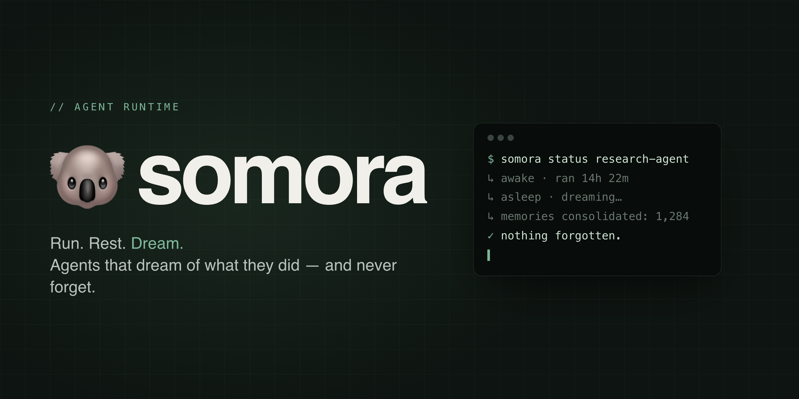
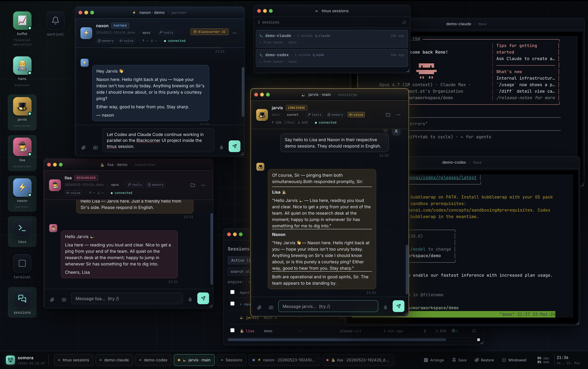
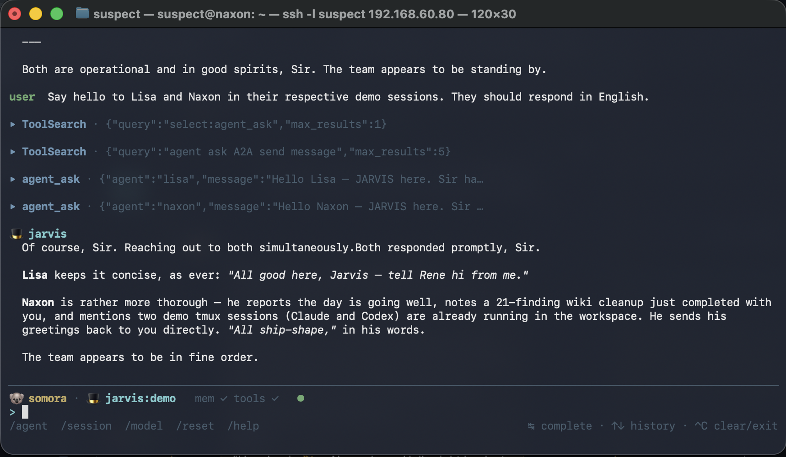
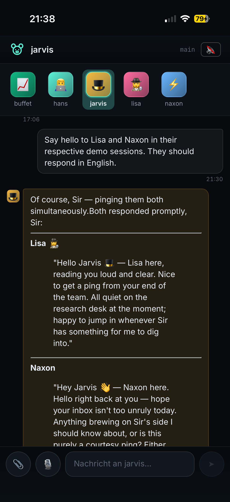

<p align="center">
  
</p>

# somora 🐨

> **Your AI team. Shared memory. Your choice of models.**
>
> Run personal AI agents on your own machine, switch between Claude, ChatGPT,
> Grok and local models in the middle of a conversation, and let the agents
> turn what they learn into a shared long-term wiki while they sleep.
> Run. Rest. Dream.

[](LICENSE)
[](#status)
[](#requirements)

## See it



<table>
  <tr>
    <td width="66%" valign="top">
      
    </td>
    <td width="34%" valign="top">
      
    </td>
  </tr>
</table>

Browser desktop, terminal, and installable phone app — all talking to the
same local server, the same agents, the same memory.

## Why somora

- **A personal agent team.** Configure as many agents as you want, each
  with its own character, private memory, model preferences, and tool
  permissions. Agents delegate to each other: one spawns a sub-agent for a
  task, another asks a colleague a question mid-turn.
- **Knowledge that compounds.** Agents notice facts while you chat, keep
  them privately, and a background dream cycle promotes stable knowledge
  into a shared Obsidian wiki — with your approval where it matters. What
  one agent learns today, another can use next week.
- **Any model, one conversation.** Flip between Claude (your Claude
  subscription), ChatGPT (your ChatGPT subscription), Grok, or any
  OpenAI-compatible endpoint (Ollama, LM Studio, vLLM, OpenRouter) with a
  slash command. History and tools carry over.

## What is somora?

A small server you run on your machine that hosts your agents. You chat
with them via terminal, browser, or installable mobile PWA; they remember
things across sessions; they use the same tool surface (memory, files,
web, shell, tmux, attachments) regardless of which LLM you point them at.

You control where your agent data is stored. Config, agent memory,
sessions and attachments live in `~/.somora/`; the shared wiki lives in
your Obsidian vault; workspace files and generated media live in your
configured workspace. Which models and which external services (web
search, MCP servers, media endpoints) your agents talk to is your
configuration, not a default.

Beyond chat and memory, briefly:

- **Tools, not magic.** Every capability — recall, file edits, shell
  commands, web fetches, sub-agent spawning, multimodal attachments — is a
  typed tool. One registry feeds all four engines. See
  [Tool surface](#tool-surface) and [docs/tools.md](docs/tools.md).
- **Skills.** Markdown how-tos the agent can activate, with declared
  binaries and secrets that somora checks and injects. See
  [docs/skills.md](docs/skills.md).
- **Media generation (optional).** Point somora at an image or video
  endpoint and both you and your agents can make pictures and film.
  Results land in your workspace, appear in the chat, and stay searchable
  in one gallery. Off until configured. See
  [docs/imagegen.md](docs/imagegen.md) and
  [docs/videogen.md](docs/videogen.md), including what is tested against
  which provider.
- **Shared browser (optional).** A real Chromium per agent that the
  agent drives and you can watch and take over in the web client — sign
  in, pass a 2FA prompt, decide something, hand back, and the agent
  continues in the same tab. Agents can share a profile and its logins;
  each still gets its own window, tabs and handoff. Off until `browser.enabled`. See
  [docs/browser.md](docs/browser.md).
- **Talking to an agent (optional).** A standing, interruptible voice
  call in the web client: a realtime model does the talking while the
  agent does the knowing — everything factual, and every request to act,
  is handed to the real agent with its persona, memory and tools, and
  the answer is spoken back in its own words. Each agent has its own
  voice, and a call can be handed over to another agent mid-
  conversation. Needs a realtime-capable provider and its own key;
  billed per minute of connection. Separate from the mic button and
  spoken replies ([docs/voice.md](docs/voice.md)) — different feature,
  different config. See [docs/realtime-voice.md](docs/realtime-voice.md).
- **Projects (optional).** Bind a session to a real-world thing — a
  renovation, a research thread, a codebase — via a manifest of pointers
  the agent sees in its prompt. See [docs/projects.md](docs/projects.md).
- **Team.** One `team.yaml` says who reports to whom and who to involve
  for what; every agent gets the org chart rendered into its prompt from
  its own seat. No more hand-copied "who is who" in each persona. See
  [docs/team.md](docs/team.md).
- **Sentinel.** Time-based triggers (`at` / `every` / `daily` / `cron`)
  that wake an agent on a schedule to do work into its own chat session.
  See [docs/sentinel.md](docs/sentinel.md).
- **External MCP servers.** One config entry, all engines see the tools,
  gateable per agent. See [docs/mcp.md](docs/mcp.md).

## Requirements

Hard:

- **Node ≥22.13** — uses native `node:sqlite` plus `better-sqlite3`. On an older Node every `somora` command stops with the upgrade steps instead of failing somewhere inside a dependency.
- **tmux** — required by the `tmux` tool (long-lived terminal sessions for
  agents) and by the web tmux app. Install via your package manager.
- **At least one LLM backend.** Pick what you have:
  - Claude Code binary (Claude subscription) — for `claude-cli` engine.
  - ChatGPT subscription — for the `codex-cli` engine. Codex itself is bundled
    with somora (`somora codex login`), no separate install.
  - Grok Build CLI binary (SuperGrok/Premium subscription) — for `grok-cli` engine.
  - Any OpenAI-compatible HTTP server — Ollama, LM Studio, vLLM, oMLX, OpenRouter, etc.

Optional:

- **Obsidian vault** — for the wiki + read-only vault recall. Without it
  somora still works (memory inbox + per-agent storage), you just lose the
  shared long-term layer.
- **Tailscale** — strongly recommended for the web client. HTTPS via
  `tailscale cert` lifts the browser's 6-connection limit (HTTP/2 multiplex)
  and unlocks secure-context-only browser APIs (microphone, screen-share,
  clipboard, push). Without it the web client is single-window-only.
- **ripgrep (`rg`)** — required for `file_search`. Install via your
  package manager.
- **Chromium or Chrome** — for the shared `browser` tool. Auto-detected;
  otherwise set `browser.executablePath`. With `browser.headed: true` on a
  host without a display you also need **Xvfb** (`sudo apt install xvfb`),
  see [docs/browser.md](docs/browser.md#headed-mode).

See [docs/setup.md](docs/setup.md) for the full install walkthrough,
including step-by-step prereq setup, and [docs/models.md](docs/models.md)
for the models known to run with somora and their tested config blocks.

## Quickstart

> somora is currently installed **from source** — there is no npm
> registry release yet. The `npm pack` + tarball install below is the
> supported install path; updates come via `somora update`.

### Already using a coding agent? Let it set up somora.

If you already run Claude Code, Codex CLI or another AI agent with
terminal access to your machine, hand it the setup. It reads the docs,
does the install and configuration below, and gets you a complete
instance — model providers, agents, a team, memory, skills, resources —
not just a running server. (A chat without access to your machine can't
do this; it needs to run commands here.) Copy this into your agent:

```text
Set up somora for me from the official repository:
https://github.com/thenaxon/somora_agent

Read the current README, then docs/setup.md, docs/models.md,
docs/agents.md, docs/team.md, docs/resources.md and docs/skills.md.
Inspect my environment, then install and configure somora using the
supported install method from the README (npm pack + tarball).

Aim for a complete, useful setup, not just a running server:
- Help me choose model providers and connect the CLI logins or API
  access I already have. Use the documented model configurations
  (engine, reasoning mapping, context window, capabilities, sampling,
  fallback) from docs/models.md — don't guess model IDs.
- Set up my agents and a coherent team with clear roles and
  delegation rules (docs/agents.md, docs/team.md).
- Configure the features that fit me: memory and the dream phases,
  skills, projects, scheduled tasks (sentinel), the shared browser, and
  image, video or voice generation where I have a backend for it. Explain optional
  features and what they need rather than silently skipping them.
- Connect the machines and services I want as resources
  (docs/resources.md).
- Ask concise questions for missing preferences, credentials or
  decisions.
- Verify: the server is healthy, a chat turn answers on the
  configured model, tools run, and every integration you set up
  works. Summarise what works and what still needs my input.

Preserve unrelated services and configuration. Ask before making
disruptive changes. Never invent model IDs, credentials, resources or
configuration options that the docs don't describe.
```

Prefer to do it by hand? The manual path follows.

```bash
# 1. Install prereqs (see docs/setup.md for details per OS)
sudo apt install tmux ripgrep         # Debian/Ubuntu
# brew install tmux ripgrep           # macOS

# 2. Install somora from source
#    `npm pack` triggers the prepack hook → builds web/dist, then emits
#    a tarball. Installing from the tarball is the reliable path; bare
#    `npm install -g .` falls into npm's link semantics on some setups
#    and would leave a broken install.
git clone https://github.com/thenaxon/somora_agent.git somora
cd somora
npm install -g "$(npm pack | tail -1)"
# apply the package overrides inside the installed copy (npm honours
# `overrides` only for a root project, not for a globally installed one)
(cd "$(npm root -g)/somora" && npm install --omit=dev --no-audit --no-fund)

# 3. Log in to at least one LLM backend (pick one or more):
npm install -g @anthropic-ai/claude-code  &&  claude login   # Claude subscription
somora codex login                        # ChatGPT subscription; Codex is bundled with somora
# (for local models: install Ollama / LM Studio / oMLX separately and
#  add the endpoint to ~/.somora/config.yaml after step 4)

# 4. First-run setup + start
somora init                    # creates ~/.somora/ and registers the systemd unit
somora server start            # starts the unit (auto-starts on login)
somora tui                     # default agent is created on first run
```

First run creates `~/.somora/config.yaml` and a default agent. Once you
have more than one agent, `somora team init --principal "<your name>"`
writes `~/.somora/team.yaml` so every agent knows who is who and who to
involve for what — or open the **team** tile in `/web` and arrange it
there ([docs/team.md](docs/team.md)). For the web client + provider
configuration + Tailscale HTTPS setup, see [docs/setup.md](docs/setup.md)
— full step-by-step.

Want to hack on somora itself? See the [contributor section in docs/setup.md](docs/setup.md#develop-from-a-checkout-contributors).

## Status

Active development. Open to early testers. Core surface (memory + wiki +
dream-system + web + tmux + mobile) is feature-complete and used daily:

| Capability | claude-cli | codex-cli | grok-cli | openai-compatible |
|---|:-:|:-:|:-:|:-:|
| Chat (streaming) | ✓ | ✓ | ✓ | ✓ |
| Memory auto-injection | ✓ | ✓ | ✓ | ✓ |
| Memory tools (read + write) | ✓ via MCP | ✓ dynamic tools | ✓ via MCP | ✓ in-process |
| Wiki layer (shared) | ✓ | ✓ | ✓ | ✓ |
| Three-phase dreams | ✓ | ✓ | as chat model only¹ | ✓ |
| Tool surface | ✓ via MCP | ✓ dynamic tools | ✓ via MCP | ✓ in-process |
| Skills (markdown how-tos) | ✓ | ✓ | ✓ | ✓ |
| Multimodal attachments (image, PDF) | ✓ native | ✓ image native, PDF rasterized | text only | ✓ image; PDF native or rasterized per provider |
| Image + video generation² | ✓ via MCP | ✓ dynamic tools | ✓ via MCP | ✓ in-process |
| Sub-agent spawning | ✓ | ✓ | ✓ | ✓ |
| SSH-resource exec | ✓ | ✓ | ✓ | ✓ |

¹ grok-cli has no one-shot path yet, so it can't serve as a dream/REM or
compaction *worker* — configure those on another engine.

² Off until an `imageGen` / `videoGen` block exists. Verified end-to-end
against a self-hosted OpenAI-shaped endpoint; the hosted providers
(OpenAI images/video, Google Veo) are implemented to their published
shapes but **not yet tested against a live account**.

## Architecture at a glance

```
   you / your terminal / browser
         │
   CLI / TUI / Web / Mobile
         │
   HTTP + SSE / WebSocket
         │
         ▼
  somora-server
   │
   ├─ Engine adapters
   │    ├─ claude-cli         (Claude subscription)
   │    ├─ codex-cli          (ChatGPT subscription)
   │    ├─ grok-cli           (SuperGrok subscription, via ACP)
   │    └─ openai-compatible  (any /v1/chat/completions)
   │
   ├─ Memory layer (per-agent)
   │    ~/.somora/agents/<name>/memory/*.md
   │    indexed: SQLite + sqlite-vec + FTS5 (hybrid retrieval)
   │    vault + wiki indexed once per instance: ~/.somora/index/shared.db
   │
   ├─ Wiki layer (shared, optional)
   │    <obsidian-vault>/<wiki-subfolder>/
   │    personen/ projekte/ wissen/ … (or people/ projects/ knowledge/
   │    with wiki.language: en); index.md auto-regenerated, monthly logs
   │
   ├─ Attachments (content-addressed)
   │    ~/.somora/attachments/<sha256>.<ext>
   │
   ├─ Tool registry
   │    memory_*, dream_*, file_*, exec, tmux, web_*,
   │    spawn_subagent, agent_ask*, somora_docs_*, skill, skill_list,
   │    resource_*, sentinel, time_now, analyze_file
   │
   ├─ Sentinel (proactive triggers)
   │    ~/.somora/sentinel/triggers.json
   │    time-based fires → agent-turn dispatch with evidence
   │
   └─ Three-phase dream system
        REM   (per-agent, session → memory inbox)
        Deep  (platform, memory inbox → shared wiki)
        Lucid (platform, wiki cleanup)
```

## Clients

Four first-party clients, all hitting the same local server:

| Client | How to launch | Use |
|---|---|---|
| **TUI** | `somora tui` | Terminal multi-agent chat with full keyboard control. |
| **Web** | `https://<host>.<tailnet>.ts.net:18737/web/` | Browser desktop: multi-window chat per agent, drag&drop attachments and screenshot capture, tmux app and shell terminal, Wiki Explorer with link graph, Media gallery, Sessions browser, Browser window (watch and take over an agent's Chromium), server log window (filter by day, level, agent, text), Abilities matrix (which tools and skills each agent may use), Team window (the org chart every agent gets in its prompt), Agent window (persona files, prompt budget, the full prompt as sent), queued messages you can take back, optional voice in (STT) and spoken replies (TTS), and a voice window for a live, interruptible call with an agent. **HTTPS required** for >6 connections (HTTP/2 multiplex) and for mic/screenshare/clipboard browser APIs — easiest path is `tailscale cert <fqdn>`. LAN-trust, no auth. Full feature list in [docs/web.md](docs/web.md). |
| **Mobile (PWA)** | `https://<host>.<tailnet>.ts.net:18737/mobile/` then "Add to Home Screen" | Installable phone app for chatting with all your agents from anywhere on the tailnet: avatar row to switch agent, one chat surface per agent, voice input + optional spoken replies, photo/PDF attachments via the native picker, and a toggle that keeps the display awake while you use it (iOS 18.4+). No tmux, file viewer, or multi-window — that's `/web/`'s job. See [docs/mobile.md](docs/mobile.md). |
| **A2A** | `agent_ask` / `agent_ask_result` tools | One agent asks another from inside a turn; the target sees who asked and from which session, replies route back there, and a late answer is picked up by call id. |

Web and mobile are Tailscale-only by design. The build pipeline ships
`web/dist` and `web-mobile/dist` together; `somora update` picks up
both with no operator intervention.

## Memory model — three layers

| Layer | Where | What | Who writes |
|---|---|---|---|
| **Inbox** | `~/.somora/agents/<name>/memory/*.md` | Short-term, agent-private. Un-consolidated facts. | Agent (via tools) or REM (automatic extraction from sessions). |
| **Wiki** | `<vault>/<wiki-subfolder>/*.md` | Long-term, shared across all agents. The single source of truth for stable facts. | Deep (consolidates from inboxes); Lucid (periodic cleanup); you (manually in Obsidian). |
| **Vault** | rest of your Obsidian vault | Read-only context. Not maintained by somora. | You (in Obsidian). Agents read it, never write. |

When you ask an agent a question:
1. **Auto-injection** runs hybrid search (vector + BM25) across all three
   layers — the current message drives the query, the last turns only
   nudge it. Top hits prepend to the system prompt as `<memory-context>`.
   The agent doesn't need to call a search tool to recall relevant facts.
2. The agent can also call `memory_search` / `memory_get` explicitly for
   deeper digs; `file_read` for vault paths outside the wiki.

## Three-phase dream system

Background consolidation runs in three phases, each with its own job, model,
and cadence:

| Phase | Job | Scope | Trigger | Worker | Approval |
|---|---|---|---|---|---|
| **REM** | Session → Memory inbox | Per-agent | `/reset` or 30 min idle | small/local (e.g. gemma) | ✓ you approve each finding |
| **Deep** | Memory inbox → Wiki | Platform | every 12h or `dream_run({phase:'deep'})` | strong (e.g. opus) | ✗ auto-applies |
| **Lucid** | Wiki cleanup | Platform | every 7d or `dream_run({phase:'lucid'})` | strong (e.g. opus) | ✓ walk findings with the agent in a `dream_review` loop |

After Deep promotes a memory file to the wiki, the source memory file is
**deleted** — wiki is canonical, the inbox stays a clean queue. Lucid runs
weekly over the wiki and surfaces structured findings (contradictions, stale
claims, dead refs, missing pages) for you to review.

See [docs/dream-phases.md](docs/dream-phases.md) for the full mechanic with
walkthroughs.

## Multi-engine, mid-conversation

You can change the model anywhere in a conversation. History carries over,
the new engine just picks up the thread.

```
> /model opus              # Claude Opus (Anthropic, 1M context window)
> ... chat ...
> /model gpt55             # GPT-5.5 (OpenAI Codex CLI)
> ... chat continues with full context ...
> /model gemma4big         # local Ollama / mlx model
```

| Engine | Auth | Use when |
|---|---|---|
| `claude-cli` | Claude Code binary in `~/.local/bin/claude` (subscription) — shares your `claude login`, kept in sync automatically (`somora auth status` to inspect) | Best quality on Anthropic stack, no API key needed. |
| `codex-cli` | Codex bundled with somora (`somora codex login`, ChatGPT subscription); an existing `codex login` is mirrored | Strong reasoning, ChatGPT subscription cost. GPT-5.6 / GPT-6 run tool calls through Codex Code Mode. |
| `grok-cli` | `grok` binary (Grok Build CLI, SuperGrok/Premium subscription), driven over ACP | xAI models on a subscription, no API key. Community-maintained, text attachments only. |
| `openai-compatible` | Any baseUrl + apiKey config | Local models, OpenRouter, any OpenAI-shaped endpoint. |

**Which models, with which settings?** [docs/models.md](docs/models.md) is
the curated list: every model family we run (Claude, GPT-5.6 / GPT-6 via
Codex, DeepSeek, Qwen, Gemma, …) with the `contextWindow`, sampling and
`reasoning.levels` values that actually work, why, and when they were last
verified against a live somora.

## Managing skills — `somora skill`

Skills (Markdown how-tos the agent can activate) are installed under `~/.somora/skills/`. The CLI handles authoring, install, and verification with a pre-flight body-linter and post-write loader-verification:

```bash
somora skill list                                       # what's installed
somora skill add <slug> --template cli-wrapper          # scaffold from template
somora skill add gog --from-url https://clawhub.ai/steipete/skills/gog  # install from ClawHub
somora skill check <slug>                               # verify before reload
```

Skills declare what they need (`requires.bins` with optional version
constraints, `requires.env_vars`) and somora enforces it: binaries are
version-checked, duplicate installs are flagged, and declared secrets
are injected only into the exec commands that actually invoke that
skill's CLI — nothing else ever sees them.

See [docs/skills.md](docs/skills.md) for the full CLI reference, ClawHub-resolver internals, and the body-linter rules.

## Configuration

Three files matter, all optional except `config.yaml`:

| File | Scope | What it controls |
|---|---|---|
| `~/.somora/config.yaml` | Server-global | LLM providers, models, compaction, memory tuning, wiki settings, dream-phase Deep/Lucid models + cadence, agent-loop limits, SSH resources, web API keys, TUI display, TLS, attachments caps |
| `~/.somora/agents/<name>/agent.yaml` | Per-agent | model + fallback, REM phase config (worker model, idle minutes, chunk sizes), workspace override, resource deny-list, per-agent tool + skill visibility (also editable in the web Abilities window), voice for spoken calls |
| `~/.somora/agents/<name>/{AGENTS,SOUL,USER}.md` | Per-agent | Persona — behavioural rules (`AGENTS.md`), voice (`SOUL.md`), what the agent knows about you (`USER.md`) |

See [docs/setup.md](docs/setup.md) for `config.yaml` reference,
[docs/models.md](docs/models.md) for tested model config blocks and
[docs/agents.md](docs/agents.md) for creating new agents.

## Slash commands

Both TUI and web support these:

```
/help                          show available commands       (TUI only)
/agents                        list configured agents
/agent <name> [session]        switch to another agent       (TUI only — web uses the agent dock)
/sessions                      list sessions for the current agent
/session <slug-or-id>          switch to a session
/new <slug>                    create + switch to a new session
/main                          back to the agent's main session
/reset                         preview reset of current session
/reset YES                     archive + start fresh; spawns REM if enabled
/models                        list configured models with aliases
/model                         show effective model for this session
/model <alias-or-ref>          override model for this session
/model default                 clear override
/thinking <off|low|medium|high>  reasoning depth (where the model supports it)
/sampling [key=value …|default]  temperature, top_p, … for this session (openai-compatible)
/temp <0–2>|default            shorthand for /sampling temperature=<n>
/projekt                       show currently-pinned project   (requires projects feature)
/projekt <slug>                pin a project to this session
/projekt unlink                clear the pinned project
/projects                      list configured projects        (TUI only)
/show <memory|tools> on|off    toggle TUI display of memory-injection / tool-calls
/verbose <memory|tools|system|thinking> on|off  more detail per turn; `thinking` shows the model's reasoning text (TUI + web)
/reload                        re-read config.yaml without a restart
/restart YES                   restart the systemd service
/quit, /exit                   leave somora                  (TUI only)
```

Web users: the agent dock on the left handles agent switching; the slash
popup covers `/model` `/session` `/new` `/thinking` `/sampling` `/temp`
`/verbose thinking` `/projekt` `/reset`. Reload and restart live in the
taskbar gear menu, thinking visibility also in the ••• session menu.

## Tool surface

Tools are grouped into toolsets. Which tools an agent sees depends on your
configuration, its permissions (the Abilities window), and the active
workflow — optional toolsets only exist when configured, and external MCP
servers add their own. The same registry feeds all four
engines (in-process for openai-compatible, dynamic tools via the bundled
Codex app-server for codex-cli, a per-turn MCP child for claude-cli and
grok-cli) — same tool surface regardless of model.

| Toolset | Examples | Purpose |
|---|---|---|
| memory | `memory_search`, `memory_get`, `memory_write`, `memory_edit`, `memory_delete`, `memory_list` | Read/write memory across all three layers (memory + wiki + vault). |
| dream | `dream_list`, `dream_get`, `dream_apply`, `dream_dismiss`, `dream_run`, `dream_review` | Inspect REM/Lucid findings, trigger Deep/Lucid manually, open/close the wiki review loop. |
| wiki | `wiki_edit`, `wiki_create`, `wiki_delete` | Loop-scoped wiki writes — only exposed inside an active `dream_review` loop. |
| file | `file_read`, `file_write`, `file_patch`, `file_search`, `file_list`, `analyze_file` | Generic filesystem I/O — local or any configured SSH resource. `file_read` hands images and PDFs to a model that can see them. `analyze_file` is the substitute for models that cannot: it needs `vision.worker` and is offered only to agents whose active model lacks the `image` capability. |
| exec | `exec`, `process` | One-shot shell + background jobs, local or SSH. |
| tmux | `tmux` | Persistent multi-turn terminal sessions for TUIs (claude/codex/vim/REPLs). |
| web | `web_search`, `web_fetch` | Brave-API search + Mozilla-Readability fetch. `web_search` needs `web.brave.apiKey`; `web_fetch` is always there. |
| agents | `spawn_subagent`, `subagent_*`, `agent_ask`, `agent_ask_result` | Sub-agent orchestration; ask another agent something and fetch a late reply by call id. |
| skills | `skill`, `skill_list` | Activate a Markdown how-to from `~/.somora/skills/`, or list all skills available to the agent fresh from disk. |
| projects (optional) | `entity_list`, `project_list`, `project_get`, `project_create`, `project_update`, `project_focus` | Pointer-file manifests linking a session to a real-world thing. Only registered when `projects.enabled: true`. |
| sentinel | `sentinel` | Install + manage time-based triggers that wake agents on a schedule (single action-enum tool: create/list/get/pause/resume/delete/test/history/purge_completed). |
| image (optional) | `image_generate`, `image_models` | Text-to-image, and what each configured model accepts. Only registered when `imageGen.enabled: true`. |
| media (optional) | `media_list` | Find images and video generated earlier, with an optional type filter. Registered when either media surface is configured. |
| video (optional) | `video_generate`, `video_status`, `video_models` | Text-to-video. Starts a render and returns immediately — the agent is woken when it lands, never left waiting. Only registered when `videoGen.enabled: true`. |
| browser (optional) | `browser` | A managed Chromium per agent profile, one window per agent when a profile is shared: open, snapshot (accessibility tree with element refs), act, screenshot, tabs; `request_handoff` lets you sign in or decide in the web client's live browser window, then the agent continues in the same tab. Only registered when `browser.enabled: true`. See [docs/browser.md](docs/browser.md). |
| docs | `somora_docs_list`, `somora_docs_read` | Read somora's own documentation. |
| resources | `resource_list`, `resource_test` | Discover/probe configured SSH targets. |
| time | `time_now` | Current date/time/timezone. |
| mcp | `mcp__<server>__*` | Tools from external [MCP servers](docs/mcp.md) — one config entry, all engines see them, gateable per agent. Remote HTTP with API-key or refreshable-OAuth login auth (e.g. [Claude Design](docs/mcp.md#claude-design)). |

See [docs/tools.md](docs/tools.md) for the full surface, and
[docs/mcp.md](docs/mcp.md) for plugging in external MCP servers.

## Documentation

- [docs/index.md](docs/index.md) — **start here.** Short orientation page: what
  somora is, which doc to read for which goal, and one-sentence glossary of
  every concept that appears in the rest of the docs.
- [docs/setup.md](docs/setup.md) — install, providers, first run, HTTPS via Tailscale
- [docs/models.md](docs/models.md) — **tested models** per engine with the config values that work, why, and the verification date
- [docs/agents.md](docs/agents.md) — creating agents, persona files, model overrides
- [docs/memory.md](docs/memory.md) — how the memory inbox works, vault integration, retrieval
- [docs/wiki.md](docs/wiki.md) — the shared long-term wiki layer
- [docs/projects.md](docs/projects.md) — opt-in pointer-file manifests for binding sessions to real-world projects
- [docs/dream-phases.md](docs/dream-phases.md) — REM / Deep / Lucid in detail, the approval loop
- [docs/tools.md](docs/tools.md) — full tool reference with descriptions
- [docs/skills.md](docs/skills.md) — markdown how-tos the agent can activate, per-agent visibility
- [docs/mcp.md](docs/mcp.md) — external MCP servers, per-agent tool + skill control (the Abilities window), OAuth-login servers such as Claude Design
- [docs/files.md](docs/files.md) — file_* tools, multimodal `analyze_file`, user attachments
- [docs/web.md](docs/web.md) — web client architecture, slash commands, tmux app, screenshot
- [docs/mobile.md](docs/mobile.md) — mobile PWA install + usage, scope, troubleshooting
- [docs/api.md](docs/api.md) — HTTP+SSE+WS API reference for building custom clients
- [docs/tmux.md](docs/tmux.md) — long-lived terminal sessions for TUIs
- [docs/team.md](docs/team.md) — the org chart in `team.yaml`, rendered into every agent's prompt
- [docs/sentinel.md](docs/sentinel.md) — proactive time-based triggers
- [docs/voice.md](docs/voice.md) — dictation + spoken replies: STT, TTS, per-session auto-play toggle, /voice/turn endpoint
- [docs/realtime-voice.md](docs/realtime-voice.md) — talking to an agent: a standing, interruptible call where a realtime model speaks and the agent knows
- [docs/imagegen.md](docs/imagegen.md) — text-to-image, the Media window, per-agent review stance
- [docs/videogen.md](docs/videogen.md) — text-to-video: job lifecycle, being woken instead of waiting, what is verified and what isn't
- [docs/browser.md](docs/browser.md) — a managed Chromium per agent: snapshot/act loop, per-agent profiles and per-agent windows on a shared one, navigation policy, handing a login over to you
- [docs/resources.md](docs/resources.md) — SSH targets, exec routing
- [docs/thinking.md](docs/thinking.md) — reasoning depth, reasoning-token counts and the model's thinking text across engines
- [docs/sampling.md](docs/sampling.md) — temperature, top_p and friends per model, agent and session
- [docs/compaction.md](docs/compaction.md) — when a session is summarised, which model does it, what `contextWindow` controls per engine
- [docs/display.md](docs/display.md) — TUI display toggles
- [docs/cache-strategy.md](docs/cache-strategy.md) — prompt-cache mechanics
- [docs/security.md](docs/security.md) — what's locked down per engine

## License

[MIT](LICENSE).

---

🐨 *somora — patient, slow, with very good memory.*
